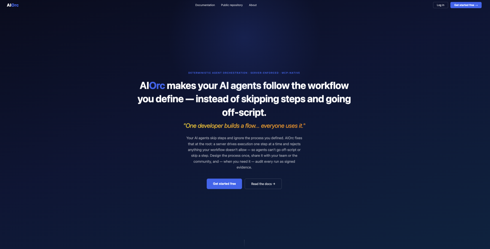
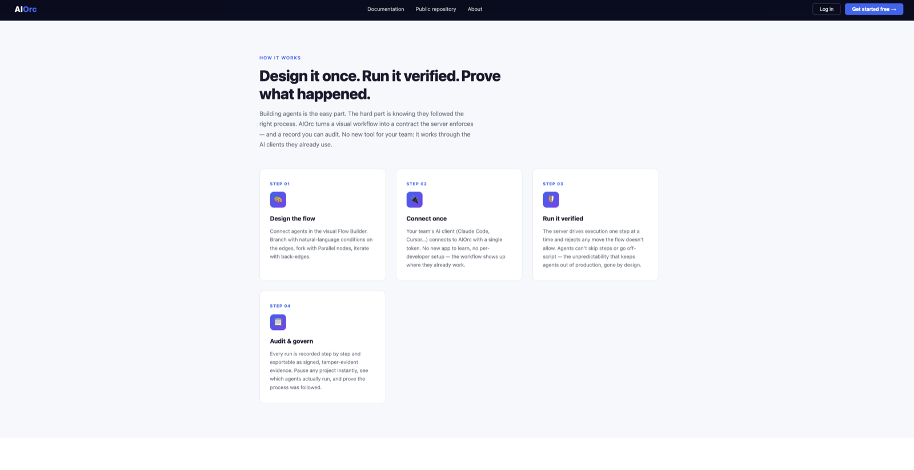
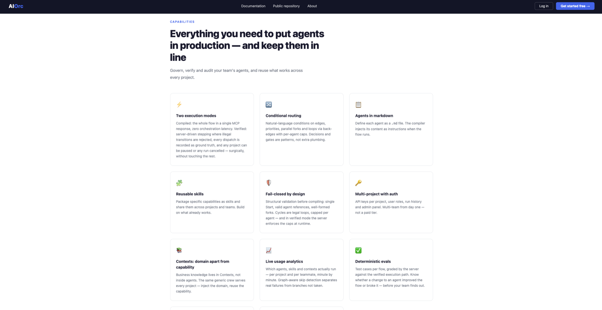
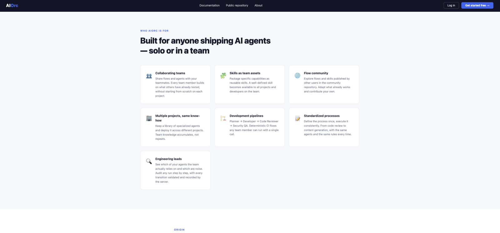

# AIOrc

**Everything Dify and n8n charge for in their Enterprise plans — multi-team workspaces, permissions, audit trails, self-hosting — is free and open source here.**

> Todo lo que Dify y n8n te cobran en su plan Enterprise — multi-equipo, permisos, auditoría, instalarlo en tus servidores — aquí es gratis.

[](https://github.com/Dich01/aiorc/actions/workflows/ci.yml)
[](LICENSE)

### Live demo

**There is an instance running right now at [204-216-144-224.sslip.io](https://204-216-144-224.sslip.io)** — the landing page is open to anyone; register a free account to create a project and draw a flow.



AIOrc is the **control plane for a company's AI agents**: a multi-tenant registry that stores, shares, governs and *measures* agents — and exposes each project's workflow to any MCP-compatible LLM client (Claude Code, Cursor, or anything that speaks MCP) with **server-verified execution**. The orchestration graph is enforced by the server, not just suggested to the model; any project can be paused instantly (kill switch), any in-flight run cancelled surgically, and every run exported as a signed, tamper-evident audit trail.

## Why

When a company adopts AI seriously, prompts and agents scatter across repos, notes and people's heads. Nobody knows which agents exist, which ones actually work, or which ones the LLM silently skips mid-workflow. AIOrc answers all three:

- **Registry**: agents, skills (reusable guardrails) and contexts (business knowledge), organized per project, shareable across users with invitations, stars, forks and issues.
- **Verified orchestration**: a visual flow editor compiles your agent DAG; in stepped mode the server hands the LLM **one step at a time**, validates every transition against the graph's edges, enforces invocation caps, and records each dispatch as ground truth — illegal jumps are rejected, skipped steps are impossible by construction.
- **Usage analytics**: live dashboards (per minute, like a market chart) of which agents, skills, projects and contexts actually run, who runs them, graph-aware skip detection (a branch not taken is *not* a skip), and per-user attribution.
- **Evals**: test cases per flow with deterministic, server-side grading — the run must complete, reach the expected outcome, and have executed every required agent. The model never grades its own work.
- **Admin panel**: platform KPIs, adoption funnel, per-user activity, top projects, community engagement and system health.

## Features

| | |
|---|---|
| Multi-tenant projects | Private (API-key) or public, with per-project agent/skill/context libraries |
| Agents, Skills, Contexts | Multi-file markdown entities; skills are deduplicated and hoisted at compile time |
| Visual flow editor | Start / Agent / Parallel / End nodes, natural-language edge conditions, loops via back-edges |
| MCP server | `workflow.start` / `workflow.next` (server-verified stepped mode), `workflow` (compiled mode), `workflow.report`, `workflow.eval` over JSON-RPC 2.0 |
| Verified execution | Server-driven stepping: illegal transitions rejected, caps enforced, every dispatch recorded as ground truth |
| Kill switch & cancel | Pause a project (blocks new runs; in-flight runs finish) or cancel a single run without touching anything else |
| Signed audit trails | Export any run as HMAC-signed JSON — tamper-evident evidence of who ran what and which path it took (Audit page) |
| Evals | Per-project test cases, run via MCP, graded deterministically against the verified path |
| Usage analytics | Live trading-style chart (1m→all-time ranges, 5s refresh), breakdowns by agent/project/skill/context, skip vs off-path classification, per-user attribution, run detail with full execution path |
| Admin panel | Users, KPIs, adoption funnel, signups, top projects, community and system health (admin role only) |
| Community layer | Stars, forks, invitations, issues with voting — an internal app store for your company's agents |

## Screenshots

**Design once, run verified, prove what happened** — the four stages of a flow's life.



**What you get** — execution modes, conditional routing, reusable skills, live analytics and deterministic evals.



**Who it's for** — from a solo developer shipping agents to a team standardizing its process.



## Quickstart

```bash
npm install
npm run dev          # API + UI on http://localhost:3001
npm run build:flow   # build the React Flow editor bundle
npm test             # unit tests (engine transitions, skip analysis, eval grading)
```

Open `http://localhost:3001`, create a user, create a project, add agents and draw the flow.

Set `JWT_SECRET` in the environment for production; a development fallback is used otherwise.

### Connect an MCP client

Point any MCP client at your project using the bridge:

```json
{
  "mcpServers": {
    "aiorc": {
      "command": "node",
      "args": ["/path/to/AIOrc/mcp-bridge.js"],
      "env": {
        "AIORC_URL": "http://localhost:3001/mcp",
        "AIORC_PROJECT_KEY": "key-...",
        "AIORC_USER_EMAIL": "you@company.com"
      }
    }
  }
}
```

`AIORC_USER_EMAIL` is optional and attributes runs to the actual person in usage analytics (the project key is shared per project).

**Recommended flow (verified mode):** the LLM calls `workflow.start`, executes only the agent(s) returned, then calls `workflow.next` with its output and the matching transition — the server validates it and returns the next step, until an End node. Eval suites run the same way via `workflow.eval`.

**Legacy flow (compiled mode):** `workflow` returns the whole orchestration prompt at once and the LLM self-reports with `workflow.report` (required by the tool contract; runs without a report can't be audited).

## Architecture

- **Backend**: Express + TypeScript + better-sqlite3 (WAL). No LLM dependency — the consuming model executes; AIOrc is the contract and the auditor.
- **Frontend**: vanilla HTML/JS pages + a React Flow editor bundle (Vite).
- **Telemetry**: every run records planned vs executed agents; analytics replays reports against the flow graph (dominator analysis) to separate real skips from branches legitimately not taken.

## Status

Early stage (v0.1), used in production internally. SQLite-backed, single-node. Postgres support and broader test coverage are on the roadmap.

## Contributing

Issues and PRs are welcome. See [CONTRIBUTING.md](CONTRIBUTING.md) for setup, project layout and conventions — the short version is `npm install && npm test` (42 tests, no framework), branch off `development`, and never commit anything under `data/`.

The areas where help goes furthest right now are Postgres support, test coverage on the routes and MCP surface, and documentation of the MCP integration path.

For security vulnerabilities, please use private reporting rather than a public issue — see [SECURITY.md](SECURITY.md).

## License

[MIT](LICENSE) — Copyright (c) 2026 Diego Cheloni.
